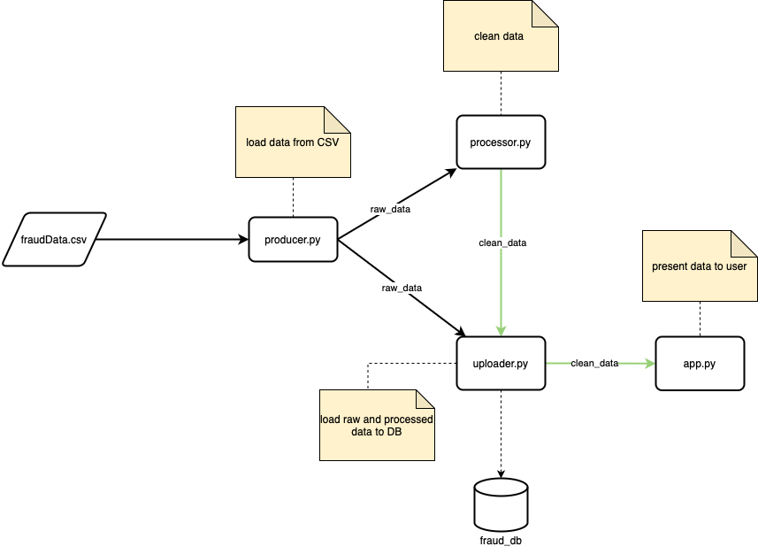

# Fraud Detection ADD Project  

**Authors:**  
Smirnova Kseniia s22239  
Azamat Maraimbekov s22850

---

## Project Overview

This project implements a real-time fraud detection pipeline using Python, RabbitMQ, and PostgreSQL. The system ingests transaction data, processes and cleans it, and stores both raw and processed data for further analysis or model training.


---

## Architecture

The system consists of three main components:

- **Producer:** Reads transaction data from a CSV file and publishes it to RabbitMQ.
- **Processor:** Consumes raw data, cleans and transforms it, then publishes the processed data back to RabbitMQ.
- **Uploader:** Consumes both raw and processed data and inserts them into PostgreSQL tables.

**Architecture Diagram:**  
 

---

## Technical Requirements

- Python 3.8+
- RabbitMQ
- PostgreSQL
- Docker (recommended for local development)
- Required Python packages: see `requirements.txt`

---

## How to Start

1. **Clone the repository:**
    ```sh
    git clone <repo-url>
    cd add_final_project
    ```

2. **(Recommended) Create and activate a virtual environment:**
    ```sh
    python3 -m venv .venv
    source .venv/bin/activate
    ```

3. **Set up environment variables:**  
   Edit the `.env` file with your RabbitMQ and Postgres credentials.

4. **Start RabbitMQ and PostgreSQL:**  
   You can use Docker Compose or run them manually.

5. **Install dependencies:**
    ```sh
    pip install -r requirements.txt
    ```

6. **Create database tables:**
    ```sh
    python src/database/create_tables.py
    ```

7. **Run the services in order:**
    - Start the **Processor**:
      ```sh
      python src/processor.py
      ```
    - Start the **Uploader**:
      ```sh
      python src/uploader.py
      ```
    - Start the **Producer**:
      ```sh
      python src/producer.py
      ```

---

## Notes

- For troubleshooting, check the logs of each service for errors.

---

## License

MIT License
